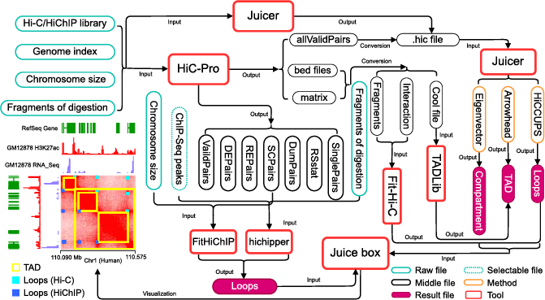

# H3DGIP
Identifying the hierarchical architecture of chromosomes
# The flowchart

# The complete process of identifying Compartment, TADs and loops by multiple software

#Quick Start
Run H3DGIP pipeline on your cluster of choice with "python H3DGIP.py [options]"
``` shell
Usage: python H3DGIP.py [-d H3DGIP directory] [-i Rawdata directory] [-n Sample name]
                        [-g Genome file] [-e Restriction enzyme] [-c Compartment resolution]
                        [-t TAD resolution] [-l Loop resolution]
* [H3DGIP directory] The absolute path of H3DGIP
* [Rawdata directory] The absolute path of Hi-C or HiChIP library
* [Sample name] The sample name
* [Genome file] The Genome file, best add absolute path
* [Restriction enzyme] The Restriction enzyme, defaults if HindIII
* [Compartment resolution] The resolution chosen for identification of the compartment
* [TAD resolution] The resolution chosen for identification of the compartment
* [Loop resolution] The resolution chosen for identification of the TAD
```
# Usage example
```shell
python H3DGIP.py -d ~/soft/H3DGIP -i Rawdata -n name -g path/genome.fa -e HIndIII -c 100000 -t 20000 -l 5000
```
By running H3DGIP pipeline, a series of configuration file will be generated 

# Detailed explanation of the compilation file
# HiC-Pro
```shell
## Enzyme fragments
python /public/home/admin/soft/H3DGIP/utils/digest_genome.py path/genome.fa -r HIndIII -o HiC-Pro_enzyme_fragments.bed

## Chromosome size
samtools faidx path/genome.fa -o path/genome.fa.fai
awk -v OFS='\t'  '{print $1, $2}' path/genome.fa.fai > HiC-Pro_chromosome_size.txt

## Bowtie2 index
ln -s path/genome.fa
bowtie2-build -f genome --threads 4

## modify the compilation file of HiC-Pro
sed -i 's/InderDir/\/public\/home\/admin\/biodate\/bio_protocol\/H3DGIP\/HiCPro/g' HiC-Pro.config
sed -i 's/GenomeName/genome/g' HiC-Pro.config
sed -i 's/ChromosomeSize/\/public\/home\/admin\/biodate\/bio_protocol\/H3DGIP\/HiCPro\/HiC-Pro_chromosome_size.txt/g' HiC-Pro.config
sed -i 's/EnzymeFragment/\/public\/home\/admin\/biodate\/bio_protocol\/H3DGIP\/HiCPro\/HiC-Pro_enzyme_fragments.bed/g' HiC-Pro.config

## High performance computing
HiC-Pro -c /public/home/admin/soft/H3DGIP/utils/HiC-Pro.config -i Rawdata -o HiCPro_result -p
cd HiCPro_result
sh HiCPro_step1.sh
sh HiCPro_step2.sh
cd ..
```
More parameter details of HiC-Pro can be found in https://nservant.github.io/HiC-Pro/


# Juicer
## identify compartment, TADs and infer loops
``` shell
## Enzyme fragments
python /public/home/admin/soft/H3DGIP/utils/generate_site_positions.py HIndIII juicer_enzyme_fragments path/genome.fa

## Chromosome size
samtools faidx path/genome.fa -o path/genome.fa.fai
awk -v OFS='\t' '{print $1, $2}' path/genome.fa.fai > juicer_chromosome_size.txt

## BWA index
ln -s path/genome.fa juicer/path/genome.fa
bwa index path/genome.fa

## run juicer_pipeline.sh to produce *.hic file
juicer.sh -z path/genome.fa -y /public/home/admin/biodate/bio_protocol/H3DGIP/juicer/juicer_enzyme_fragments_HIndIII.txt -p /public/home/admin/biodate/bio_protocol/H3DGIP/juicer/juicer_chromsome_size.txt -d Rawdata -D juicer_output/ -t 4

## Identify compartment
java -jar /public/home/admin/soft/H3DGIP/utils/juicer_scripts/juicer_tools.jar eigenvector KR juicer_output/name.hic chr1 BP 100000
## Identify TADs
java -jar /public/home/admin/soft/H3DGIP/utils/juicer_scripts/juicer_tools.jar arrowhead -m 2000 -r 20000 -k KR --threads 4 juicer_output/name.hic juicer_output
## Infer loops
java -jar /public/home/admin/soft/H3DGIP/utils/juicer_scripts/juicer_tools.jar hiccups --cpu -r 5000 -f 0.1 -p 4 -i 7 -d 20000 -t 0.02,1.5,1.75,2 -k KR --threads 4 juicer_output/name.hic juicer_output
```
More parameter details of Juicer can be found in https://github.com/aidenlab/juicer/wiki


# TADLib
## identify TADs

``` shell
## Produce cool file
python /public/home/admin/soft/H3DGIP/utils/hicproTocool.py -m ../HiCPro_result/hic_results/matrix/raw/20000/name_20000.matrix -b ../HiCPro_result/hic_results/matrix/raw/20000/name_20000_abs.bed -o TADLib/intramtx -YN N

## toCooler from HiCPeaks
toCooler -O TADLib/TADLib.cool -d dataset --chromsize-file ../HiCPro/HiC-Pro_chromosome_size.txt

## Identify TADs
hitad -O TADLib_result/TADLib_TAD.bed -d meta_file --logFile hitad.log -p 4
```
More parameter details of TADLib can be found in https://xiaotaowang.github.io/TADLib/hitad_api.html


# Fit-Hi-C
## identify loops

``` shell
## Convert the result file produce by HiC-Pro to the input file of Fit-Hi-C
python /public/home/admin/soft/H3DGIP/utils/hicpro2fithic.py -i ../HiCPro_result/hic_results/matrix/raw/5000/name_5000.matrix -b ../HiCPro_result/hic_results/matrix/raw/5000/name_5000_abs.bed -r 5000 -o ./ -n FitHiC

## Infer loops
fithic -f ./FitHiC.fithic.fragmentMappability.gz -i ./FitHiC.fithic.interactionCounts.gz -r 5000 -L 6000 -U 3000000 -p 2 -o FitHiC_result -l FitHiC
```
More parameter details of Fit-Hi-C can be found in https://github.com/ay-lab/fithic


# FitHiChIP
## identify loops
``` shell
## modifiy the configure file
cp /public/home/admin/soft/H3DGIP/utils/configfile_BiasCorrection_ICEBias ./
sed -i 's/ValidPairs/..\/HiCPro\/hic_results\/data\/name\/name.allValidPairs/g' configfile_BiasCorrection_ICEBias
sed -i 's/chromSize/..\/HiCPro\/HiC-Pro_chromosome_size.txt/g' configfile_BiasCorrection_ICEBias
# The optional compilation file contains configfile_BiasCorrection_ICEBias, configfile_BiasCorrection_CoverageBias, configfile_P2P_BiasCorrection_CoverageBias, configfile_P2P_BiasCorrection_ICEBias

## Infer loops
bash /public/home/admin/soft/H3DGIP/utils/FitHiChIP_HiCPro.sh -C configfile_BiasCorrection_ICEBias
```
More parameter details of FitHiChIP can be found in https://ay-lab.github.io/FitHiChIP/


# hichipper
## identify loops

``` shell

## running hichipper
hichipper --out hichipper_result hichipper_config.yaml
```
More parameter details of hichipper can be found in https://hichipper.readthedocs.io/en/latest/
